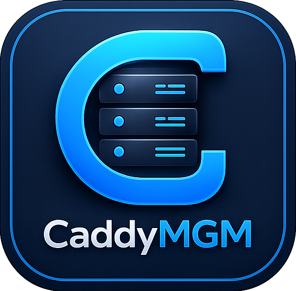
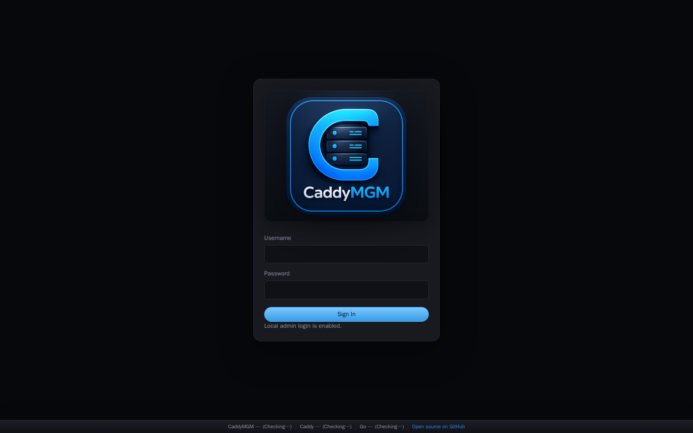
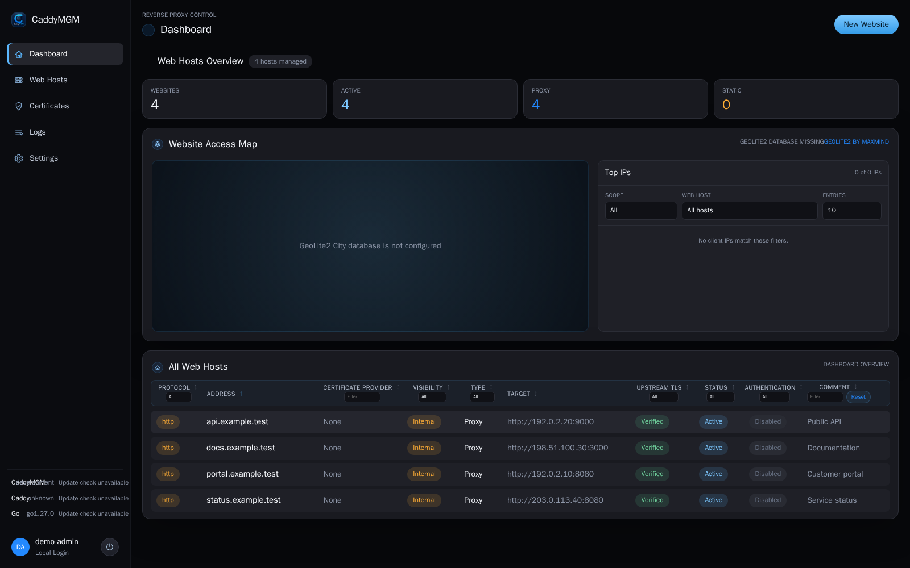
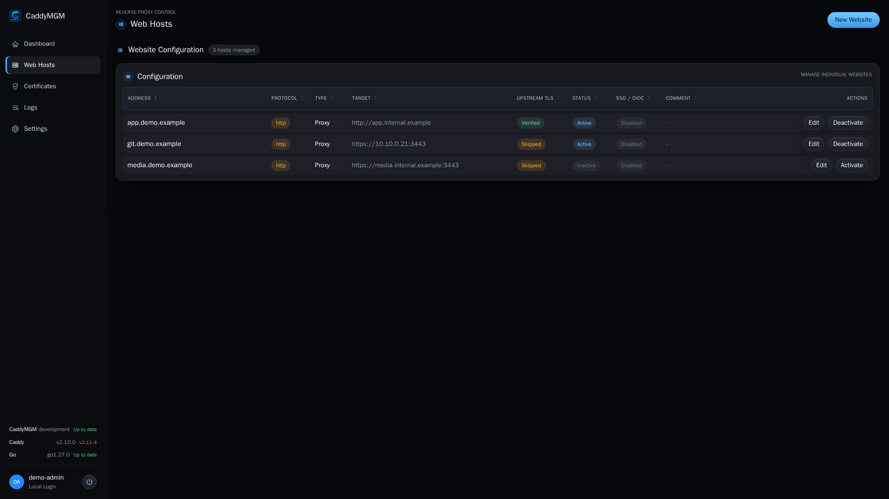
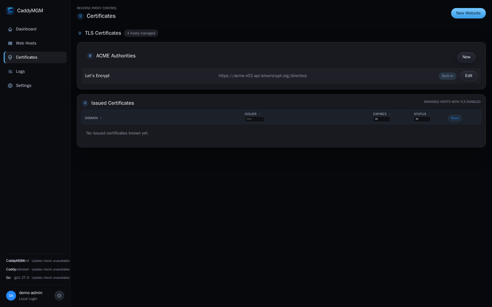
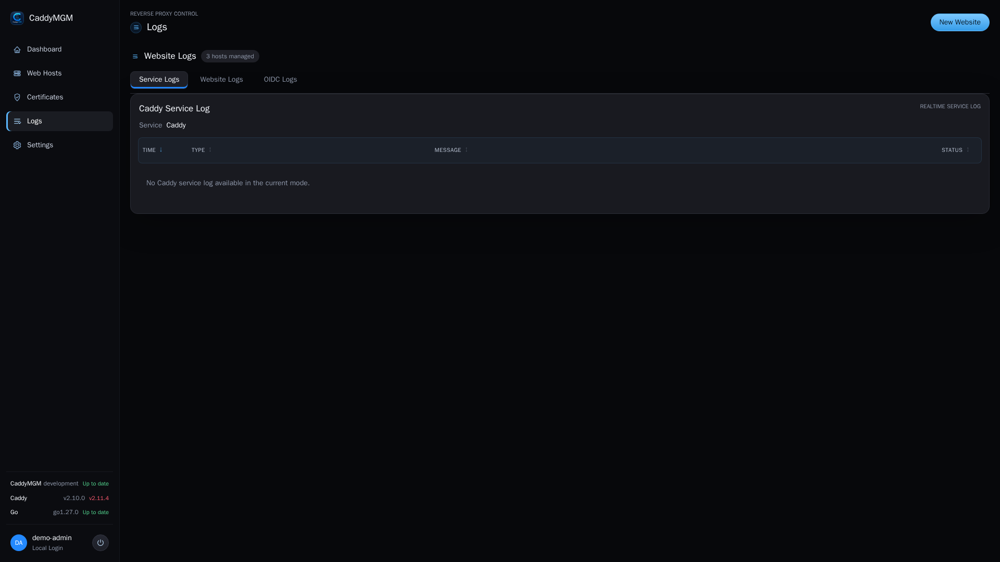
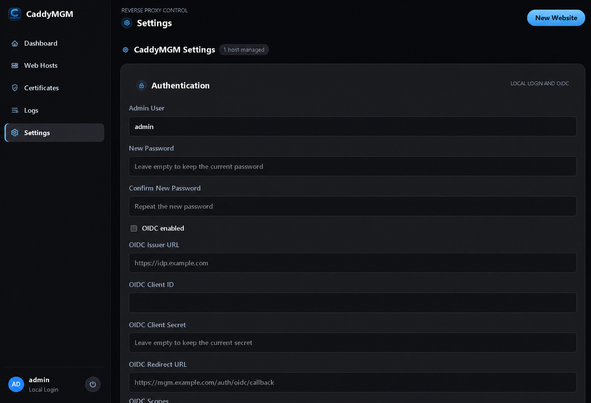

<p align="center">
  
</p>

# caddymgm

<p align="center">Management web interface for Caddy web hosts.</p>

## Overview

CaddyMGM gives you a web UI to:

- view all managed web hosts
- create and edit reverse proxies or static file hosts
- manage ACME authorities
- inspect website logs
- map website accesses by GeoLite2 location and client IP
- manage CaddyMGM authentication and web interface settings
- protect individual web hosts through one central OIDC provider

The Caddy configuration stays outside the container.
Caddy can run separately and can be updated independently from CaddyMGM.

## Recently Added Features

| Date | Feature | What's included |
| --- | --- | --- |
| 2026-09-01 | **Web Protection Operations** | Named manual allow/deny IP lists, managed external blocklists, protection-event dashboard metrics, and a filterable Web Protection log view. |
| 2026-08-31 | **Runtime Security Hardening** | Supported Alpine 3.24 runtime with current security packages plus updated Go cryptography and OAuth dependencies. |
| 2026-08-31 | **Web Protection** | Global Geo-IP country blocking, IP/CIDR deny and allow rules, per-host overrides, and validated external threat feeds. |
| 2026-08-31 | **Response Compression** | Per-host `Off`, `Gzip`, or `Zstandard + Gzip` profiles with automatic client negotiation and Gzip fallback. |
| 2026-08-31 | **TLS Controls** | Configurable minimum and maximum TLS versions while cipher suites remain securely managed by Caddy. |
| 2026-08-28 | **Web Host Navigation** | Structured editor with `Basic`, `Forwarding Rules`, `Advanced`, and `Authentication` sections plus a live host summary. |
| 2026-08-28 | **Disabled Host Page** | Managed HTTP 503 response while retaining the complete web-host configuration. |
| 2026-08-28 | **Website Security Controls** | Redirect rewriting, additional advertised origins, managed Host and forwarded headers, HSTS, Standard/Strict security headers, and bcrypt-based Basic Authentication. |
| 2026-08-26 | **Website OIDC Authentication** | Central OIDC authentication for protected web hosts. |

## Planned Upcoming Features

### Client IP and network listeners

- Configurable visitor IP source (`Get Attack IP From`)
- Explicit IPv6 listener configuration
- Per-web-host IPv4/IPv6 and port 80/443 listener selection
- Controlled clearing and rewriting of `X-Forwarded-For`

### HTTP routing and transport

- Configurable automatic HTTP-to-HTTPS redirects
- Server-Sent Events (SSE) streaming support
- Configurable upstream read timeout
- Configurable upstream connection timeout
- Advanced low-level reverse-proxy configuration

### Authentication

- LDAP integration for website authentication or OIDC
- NTLM authentication

### HTTP headers and access security

- Configurable HTTP header operations
- Additional security features to protect managed websites, including:
  - access policies for everyone, allowed IPs, or blocked IPs
  - IP address and CIDR lists
  - maximum request body size limits
  - allowed HTTP methods
  - blocked paths

## Screenshots

| View | Preview |
| --- | --- |
| **Login**<br>Authenticate through the local administrator account before opening the management interface. |  |
| **Dashboard**<br>See all managed web hosts and their current state at a glance. |  |
| **Web Hosts**<br>Create and edit reverse proxies and static websites from the rule editor. |  |
| **Certificates**<br>Manage built-in and custom ACME authorities and inspect issued certificates. |  |
| **Logs**<br>Follow the Caddy service log and per-host access logs in realtime. |  |
| **Settings**<br>Configure authentication, the management interface, and log retention. |  |

## Quick Start

1. Create the local Compose and environment files from their templates:

```bash
cp compose-template.yml compose.yml
cp .env.example .env
```

2. Start CaddyMGM:

```bash
docker compose up -d --build
```

3. Open:

```text
http://localhost:8080
```

4. Log in with the credentials from `.env`.

For remote access, publish CaddyMGM only behind HTTPS.
Local `http://localhost:8080` access remains supported for development on the same machine.

## Integrated GeoLite2 Database Updates

Create a free MaxMind account and license key, set `MAXMIND_ACCOUNT_ID` and `MAXMIND_LICENSE_KEY` in `.env`, then rebuild and start CaddyMGM:

```bash
docker compose up -d --build
```

CaddyMGM runs the official `geoipupdate` client inside the CaddyMGM container and refreshes `GeoLite2-City` every 72 hours. The database remains outside the image under `./caddymgm/geoip/GeoLite2-City.mmdb`. No separate updater service is required. Without the database, the dashboard displays a configuration notice and all other features remain available. Client IPs are read only from the retained local Caddy logs and returned only by the authenticated dashboard API.

## Web Protection

`Web Protection` is a main navigation page for global protection defaults. Its country picker is generated from the installed GeoLite2 database and displays searchable country or territory names, ISO codes, checkboxes, and flag images. Country rules can either block only the selected countries or allow only the selected countries. Global rules also support blocked public IP addresses or CIDR ranges and a higher-priority IP/CIDR allowlist. Individual web hosts inherit these defaults unless `Web Hosts -> Advanced -> Web Protection` enables an explicit override.

The `External Blocklists` subpage accepts administrator-defined feeds with a descriptive name and HTTPS URL. Entries can be added and removed in the table. It shows the deduplicated total of blocked IPs, the entry count and last successful update per feed, and provides a per-feed update action as well as an update-all action. CaddyMGM rejects URLs that target or resolve to local and private addresses, validates and deduplicates public IP/CIDR entries, rejects oversized responses, and keeps the previously active rules if a refresh fails. External entries extend the global blocked-IP rules; the allowlist continues to take priority.

## Optional Caddy Service

If you also want Docker Compose to run Caddy, enable the profile:

```bash
COMPOSE_PROFILES=docker-caddy docker compose up -d --build
```

The Compose-managed Caddy service is built locally from the official, version-pinned Caddy image. It includes the Geo-IP module required for country-based access controls. The Caddy image and module versions are fixed through `CADDY_VERSION` and `CADDY_GEOIP_MODULE_VERSION`; both can be reviewed and updated explicitly. The GeoLite2 database remains a read-only runtime mount at `/geoip/GeoLite2-City.mmdb`, so database refreshes do not rebuild the Caddy image.

The scheduled GitHub workflow `Check Caddy version` compares the pinned version with the latest official Caddy release every Monday. When an update is available, it creates or refreshes one GitHub issue; it never updates the image or publishes a release automatically.

This publishes:

- `80` for HTTP
- `443` for HTTPS
- `8080` for the management entrypoint through Caddy

## Runtime Folders

The repository root is the runtime structure:

| Path | Purpose |
| --- | --- |
| `./caddy-config` | External Caddy configuration |
| `./caddy-data` | Caddy data, certificates, state, Root CAs, and local static site files |
| `./caddy-logs` | Website access logs and Caddy service log |
| `./caddymgm` | CaddyMGM settings file |
| `./caddymgmdev` | Go source code, frontend, and Docker build context |

## Important Files

| File | Description |
| --- | --- |
| `./caddy-config/Caddyfile` | Main Caddyfile managed by CaddyMGM |
| `./caddymgm/caddymgm-settings.json` | Persistent CaddyMGM settings |
| `./caddymgm/auth-providers.json` | Automatically managed central OIDC provider configuration; exists only while Central Website SSO is enabled |
| `./caddymgm/oidc-audit.log` | Automatically managed OIDC authentication audit log; no Compose variable is required |
| `./caddy-logs/caddy-service.log` | Caddy runtime/service log |
| `./caddy-logs/<domain>.access.log` | Per-host JSON access log |
| `./caddy-data/site` | Document roots for local static sites served by Caddy under `/srv` |
| `./caddy-data/ca-certificates` | Custom Root CA certificates mounted for Caddy and CaddyMGM |

## Caddy Integration Modes

| Mode | Behavior |
| --- | --- |
| `file` | Only writes the Caddyfile |
| `native` | Writes the Caddyfile and reloads a native or remote Caddy via Admin API |
| `docker` | Writes the Caddyfile and reloads the Compose Caddy service via Admin API |
| `api` | Same behavior as API-driven mode for a reachable Caddy Admin API |

## Per-Web-Host TLS Controls

TLS remains disabled for newly created web hosts. After TLS is enabled and an ACME authority is selected, each host can optionally restrict its accepted TLS protocol versions under `Web Hosts -> Advanced`. Cipher suites remain securely managed by Caddy.

### Protocol versions

The minimum and maximum protocol versions can independently use `Caddy default`, `TLS 1.2`, or `TLS 1.3`.

- `Caddy default` currently means a minimum of TLS 1.2 and a maximum of TLS 1.3. These defaults come from Caddy and may evolve with future Caddy security updates.
- Leave both fields at `Caddy default` to inherit those current secure defaults automatically. This is the recommended setting unless a specific security or compatibility policy requires fixed values.
- Set the minimum to `TLS 1.2` and maximum to `TLS 1.3` to explicitly allow both supported versions.
- Set both fields to the same version to allow only that protocol version.
- The minimum version cannot be higher than the maximum version.

CaddyMGM validates protocol ranges before writing the Caddyfile. The settings survive Caddyfile read/write cycles and also remain enforced while a host is disabled and serves the managed unavailable page. Certificate issuance and ACME authority selection are independent from these protocol restrictions.

## Security Header Profiles

The `Security header profile` setting is configured per web host under `Web Hosts -> Advanced`. The default is `Off`, which means CaddyMGM does not add or replace managed security headers and leaves the upstream application's response headers unchanged.

### Standard (Recommended)

The Standard profile provides broadly compatible browser protections:

- removes the `Server` response header
- sets `X-Content-Type-Options: nosniff` to prevent MIME type sniffing
- sets `Referrer-Policy: strict-origin-when-cross-origin` to limit referrer details sent across origins
- sets `X-Frame-Options: SAMEORIGIN` to allow framing only by the same origin

### Strict

The Strict profile provides stronger restrictions:

- removes the `Server` response header
- sets `X-Content-Type-Options: nosniff`
- sets `Referrer-Policy: no-referrer` so no referrer information is sent
- sets `X-Frame-Options: DENY` to prevent all framing
- sets `Permissions-Policy: camera=(), geolocation=(), microphone=()` to disable those browser features
- sets the following Content Security Policy:

```text
default-src 'self'; base-uri 'self'; form-action 'self'; frame-ancestors 'none'; object-src 'none'; img-src 'self' data: https:; font-src 'self' data:; style-src 'self' 'unsafe-inline'; script-src 'self'; connect-src 'self' https: wss:
```

The Strict profile can break applications that require external scripts, CDNs, embedded frames, inline JavaScript, external API connections, or restricted browser capabilities. Use Standard as the normal starting point and enable Strict only after testing the application. HSTS is configured separately through `HTTP Strict Transport Security (HSTS)` and is not part of either security header profile.

## Response Compression

Response compression is configured per web host under `Web Hosts -> Advanced`. The default is `Off`, so existing hosts keep their current behavior until compression is explicitly enabled.

| Profile | Caddy directive | Behavior |
| --- | --- | --- |
| `Off` | none | Does not add managed response compression. |
| `Gzip` | `encode gzip` | Provides broadly compatible compression for suitable responses. |
| `Zstandard + Gzip (Recommended)` | `encode zstd gzip` | Prefers Zstandard when the client supports it and falls back to Gzip. |

Caddy negotiates the encoding from the client's `Accept-Encoding` header and only compresses suitable response types. Text-based content such as HTML, CSS, JavaScript, JSON, XML, and SVG usually benefits most. Files that are already compressed, including JPEG, PNG, MP4, ZIP, and most PDFs, generally see little or no benefit.

Brotli is intentionally not offered because it is not included in the standard Caddy image used by this project and would require a custom Caddy build. A managed compression profile cannot be combined with a manual `encode` directive under `Additional settings`; remove the manual directive before enabling managed compression.

## Central Website SSO

CaddyMGM can protect multiple web hosts through one central OIDC client. Configure an HTTPS SSO Base URL such as `https://sso.example.com` under `Settings -> Authentication -> SSO / OIDC`, then register exactly this callback at the identity provider:

```text
https://sso.example.com/.caddymgm/auth/callback
```

Enable `SSO / OIDC` on each web host that should require authentication. The first login creates a central SSO session. Access to another protected host uses a short-lived, single-use, host-bound ticket to establish a separate secure cookie for that host. The identity provider controls which users may use the OIDC client.

## Web UI Notes

- `Dashboard` shows Top IPs with combined scope (`All`, `Internal`, `External`), web-host, and 10/25/50/100-entry filters. Host selection recalculates request counts and ranking for that host.
- Private client IPs are included in Top IPs but are not plotted on the public GeoLite2 map.

- New web hosts have logs enabled by default.
- New web hosts have TLS disabled by default.
- TLS is only requested when you enable it for a host and select an ACME authority.
- Static websites must use a document root under `/srv` inside the Caddy container.
- `Certificates` shows configured ACME authorities and issued certificates.
- `Logs` uses horizontal tabs for realtime Caddy service logs, website access logs, and OIDC authentication events.

## Authentication

CaddyMGM supports:

- local username/password login
- OIDC login
- both at the same time

The login page changes automatically based on your `.env` settings.

## Custom ACME Root CAs

If your ACME server uses a private Root CA:

1. place the certificate in `./caddy-data/ca-certificates`
2. or upload it in `Certificates`
3. reference it in the ACME authority

Supported file types:

- `.crt`
- `.cer`
- `.pem`

Inside the container these files are available under:

```text
/ca-certificates
```

## Compose and Environment Variables

The following variables are used by Docker Compose and CaddyMGM.

| Variable | Default | Description |
| --- | --- | --- |
| `PUID` | `1000` | User id used for container file ownership |
| `PGID` | `1000` | Group id used for container file ownership |
| `CADDYMGM_ADMIN_USER` | `admin` | Initial local admin username |
| `CADDYMGM_ADMIN_PASSWORD` | required for first startup | Initial local admin password; no default password is generated |
| `CADDYMGM_AUTH_ENABLED` | `true` | Enables the login portal |
| `CADDYMGM_LOCALAUTH_ENABLED` | `true` | Enables local username/password login |
| `CADDYMGM_ALLOW_INSECURE_HTTP` | `false` | Allows remote login over unencrypted HTTP for initial setup; disable after HTTPS is configured |
| `CADDYMGM_OIDCAUTH_ENABLED` | `false` | Enables OIDC login |
| `CADDYMGM_CADDY_MODE` | `file` | Caddy integration mode |
| `CADDYMGM_CADDY_API_URL` | `http://caddy:2019` in example | Caddy Admin API URL for reloads |
| `CADDYMGM_TRUSTED_PROXIES` | empty | Comma-separated proxy IPs, CIDRs, or hostnames allowed to supply forwarded HTTPS headers |
| `CADDYMGM_ACCESS_LOG_DIR` | `/logs` | Directory from which CaddyMGM reads website logs |
| `CADDYMGM_GEOIP_DB_PATH` | `/caddymgm/geoip/GeoLite2-City.mmdb` | Local MaxMind GeoLite2 City database used by the dashboard map |
| `MAXMIND_ACCOUNT_ID` | empty | Free MaxMind account ID used by the integrated GeoLite2 updater |
| `MAXMIND_LICENSE_KEY` | empty | MaxMind license key used by the integrated GeoLite2 updater |
| `CADDYMGM_CADDY_DATA_DIR` | `/caddy-data` | Directory used to inspect certificate data |
| `CADDYMGM_CA_CERT_DIR` | `/ca-certificates` | Directory for uploaded or mounted Root CAs |
| `CADDYMGM_STATIC_ROOT_BASE` | `/srv` | Allowed base path for static website document roots |
| `CADDYMGM_WEB_LISTEN` | `:8080` | Internal listen address of the Go web server |
| `CADDYMGM_WEB_PORT` | `8080` | Public management port used through Caddy |
| `CADDYMGM_SETTINGS_PATH` | `/caddymgm/caddymgm-settings.json` | Path to the CaddyMGM settings file |
| `CADDY_ACCESS_LOG_DIR` | `/logs` | Directory written into generated Caddy log directives |
| `COMPOSE_PROFILES` | `docker-caddy` in example | Start optional Compose services such as Caddy |
| `CADDY_IMAGE` | `caddymgm-caddy:development` | Locally built Caddy image including the Geo-IP module |
| `CADDY_VERSION` | `2.11.4` | Version-pinned official Caddy base image used for the local build |
| `CADDY_GEOIP_MODULE_VERSION` | `v0.6.0` | Version-pinned Geo-IP Caddy module used for the local build |
| `CADDY_HTTP_PORT` | `80` | Host port mapped to Caddy HTTP |
| `CADDY_HTTPS_PORT` | `443` | Host port mapped to Caddy HTTPS and HTTP/3 UDP |

## Example `.env`

```text
PUID=1000
PGID=1000
CADDYMGM_ADMIN_USER=admin
CADDYMGM_ADMIN_PASSWORD=replace-with-a-strong-password
CADDYMGM_AUTH_ENABLED=true
CADDYMGM_LOCALAUTH_ENABLED=true
CADDYMGM_ALLOW_INSECURE_HTTP=true
CADDYMGM_OIDCAUTH_ENABLED=false
CADDYMGM_CADDY_MODE=file
CADDYMGM_CADDY_API_URL=http://caddy:2019
CADDYMGM_TRUSTED_PROXIES=caddy,caddy-admin
CADDYMGM_STATIC_ROOT_BASE=/srv
CADDYMGM_WEB_PORT=8080
COMPOSE_PROFILES=docker-caddy
```

`CADDYMGM_ALLOW_INSECURE_HTTP=true` is intended only for initial setup on a trusted network.
Set it to `false` and restart CaddyMGM as soon as HTTPS is available. Credentials and session
cookies are otherwise transmitted without transport encryption.
